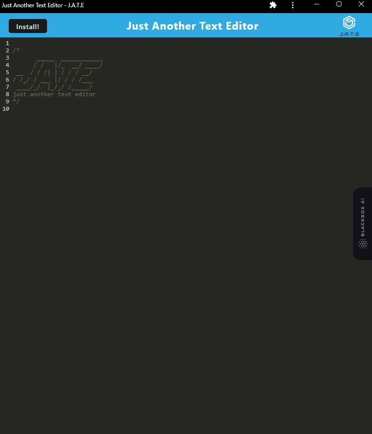

# PWA Text Editor

## Table of Contents

[Descripton](#Description)

[Usage](#Usage)

[Demo](#Demo)

[Credits](#Credits)

[Links](#Links)

## Description

A text editor that can be installed to your desktop as a PWA. The application uses IndexedDB to store your notes and code snippets. The application also uses a service worker to cache static assets and the application's manifest file.

## Usage

How to run the Text Editor:

- Clone the repository to your local machine
- Open the terminal and navigate to the root directory of the project
- Run `npm install` to install the dependencies
- Run `npm start:dev` to start the server
- Open your browser and navigate to `localhost:3000`
- Click the install button in the address bar to install the application to your desktop

## Demo

## Credits

- [React](https://reactjs.org/)
- [Webpack](https://webpack.js.org/)
- [IndexedDB](https://developer.mozilla.org/en-US/docs/Web/API/IndexedDB_API)

The starter code was provided by the [University of Berkley Coding Bootcamp](https://github.com/coding-boot-camp/cautious-meme).

## Links

[GtiHub](https://github.com/Badermah/text-editor)
